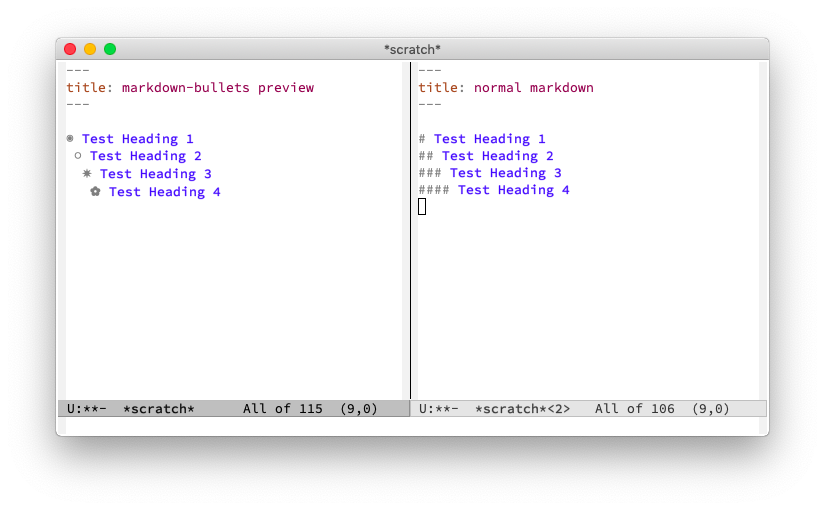

# `markdown-bullets`

A Markdown port of [`org-bullets`](https://github.com/emacsorphanage/org-bullets) for prettifying Markdown headings.



## Usage

`M-x markdown-bullets-mode` or


``` elisp
(add-hook 'markdown-mode #'markdown-bullets-mode)
```
